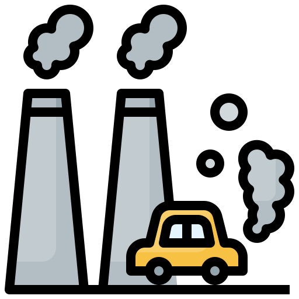

# Data Scientist
#### Progamming Languages/Tools:  Python, R, SQL, Tableau, Spark, Docker, Microsoft Excel. 
#### Libraries: TensorFlow, Keras, Scikit-Learn, Seaborn, Matplotlib, Pandas, Numpy. 
#### Techniques: Data Preprocessing, Feature Engineering, Exploratory Data Analysis (EDA), Machine Learning Algorithms, Model Evaluation and Tuning, Statistical Analysis.
#### Soft Skills: Problem Solving, Communication, Critical Thinking, Attention to Detail, Adaptability, Time Management, Curiosity, Collaboration, Resilience, Ethical Awareness.
#### Languages: Indonesian and English.

## Education
- Data Science | BINUS University (_2022 - Present_)
- Mathematics and Science | Don Bosco II High School (_2019 - 2022_)
  
## Organization and Volunteer Experience
**Head of Human Capital Department at Data Science Club BINUS University (_Feb 2024 - Present_)**
- Fostered a collaborative and inclusive team environment, resulting in increased team productivity.
- Developed and executed comprehensive strategies for talent acquisition, development, and retention.
- Facilitated communication channels to address concerns, provide guidance, and ensure alignment between human capital strategies and organizational goals.

**Freshmen Partner at BINUS University**
- Provided essential assistance to incoming students during their transition to university life in the First Year Program at BINUS University.
- Offered individualized support and shared valuable information about academic resources, campus facilities, and services to ensure new students felt comfortable and well-informed.
- Engaged with new students by answering questions, facilitating meaningful discussions, and sharing practical tips to help them adjust to university life and foster a sense of belonging within the campus community.

**MC and Volunteer of ASEAN DSE National Finals Indonesia, ASEAN Foundation**
- Led team meetings to assist presenters in preparing for the ASEAN DSE National Finals.
- Followed provided scripts while making necessary adjustments to ensure smooth event execution and audience engagement.
- Managed transportation allowances for all volunteers and ensured proper documentation by overseeing the signing of receipts.

## Projects
### COVID-19 Impact to US Economy
[Explore](https://github.com/kimikayz/projects/tree/1b13fa484f04de79285169472e583d47d463abb8/Data%20Mining%20%26%20Visualization%20Project)

My team and I analyzed the economic progress of the United States from 1913 to 2023, focusing on the significant impacts of COVID-19. We defined the problem statement, conducted exploratory data analysis (EDA), and developed a predictive model using linear regression. Our findings highlight the economic trends over the past century, with a specific emphasis on the shifts observed after the pandemic. Through our analysis, we aim to forecast the potential trajectory of the US economy in the near future, providing valuable insights into recovery and growth. All analyses were performed using R.

[Source Picture](https://www.simbhq.org/sbfc/covid-19-information/)

### Air Pollution Analysis and Modeling Prediction
[Explore](https://github.com/kimikayz/projects/tree/7a12d8916727133c3ccf783b9f22cb11cebea99b/Artificial%20Intelligence%20Project)

My team and I undertook a comprehensive project aimed at tackling air pollution challenges in DKI Jakarta. Leveraging advanced machine learning techniques, we developed a predictive model using data collected from five air quality monitoring stations throughout the province in 2021. Our objective was to forecast future pollution levels, equipping stakeholders with crucial insights to effectively manage environmental issues and protect public health. All analyses were conducted using Python.

[Source Picture](https://www.freepik.com/icon/air-pollution_3432056)

### Advancing House Price Prediction Through Machine Learning
[Explore](https://github.com/kimikayz/projects/tree/7a12d8916727133c3ccf783b9f22cb11cebea99b/Machine%20Learning%20Project)

My team and I developed a machine learning model to predict housing prices using data on key factors like 'area,' 'bathrooms,' and 'parking.' We applied models such as KNN, Linear Regression, and K-Means to the dataset, with Linear Regression emerging as the most accurate, explaining 60.7% of price variation. This project, implemented in Python, offers a reliable tool for stakeholders to make informed decisions in the real estate market.

[Source Picture](https://www.flaticon.com/free-icon/house-price_1044298)

